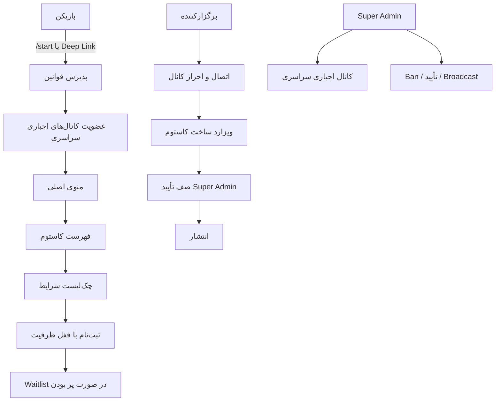
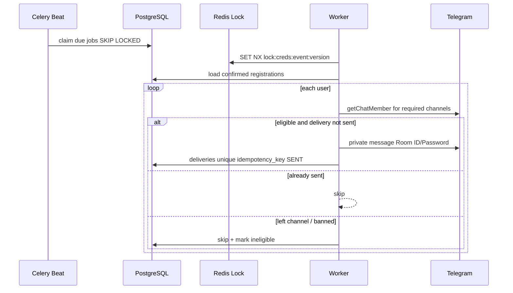

# معماری سیستم

## نقش‌ها و جریان اصلی

## ارسال رمز اتاق

## انتخاب‌های فنی

| انتخاب | دلیل |
|---|---|
| aiogram 3 | FSM رسمی، webhook/polling، سازگار با Python 3.12 |
| FastAPI | OpenAPI، async، همان دامنه سرویس‌ها با ربات |
| PostgreSQL | تراکنش، `SELECT FOR UPDATE SKIP LOCKED` برای ظرفیت و Job |
| Redis | Rate limit، lock توزیع‌شده، FSM، broker |
| Celery | Restart-safe، صف جدا، retry |
| Fernet | رمزنگاری متقارن reversible برای ارسال بعدی |
| Next.js | پنل RTL جدا از توکن ربات |

Jobهای زمان‌دار در جدول `scheduled_jobs` ذخیره می‌شوند نه فقط ETA سلری؛ Restart و چند Worker باعث ارسال دوباره نمی‌شود.
